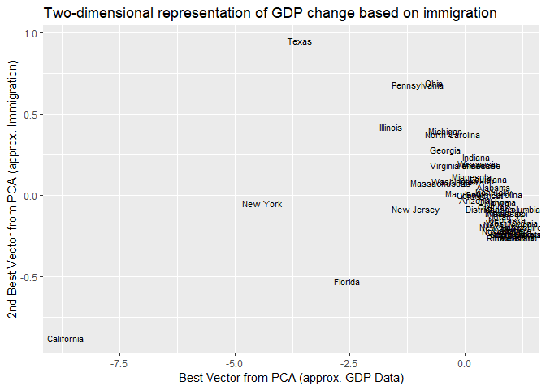
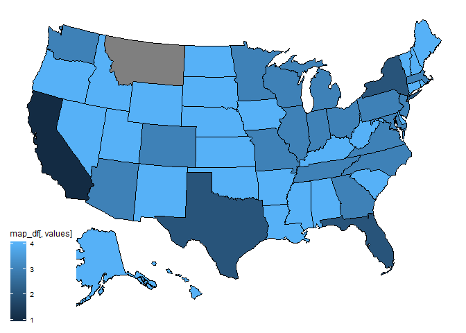
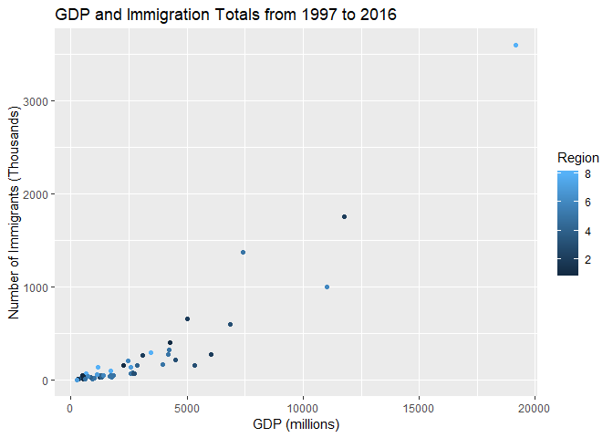
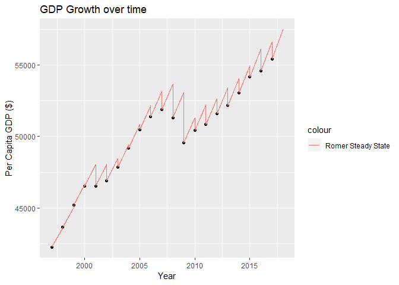
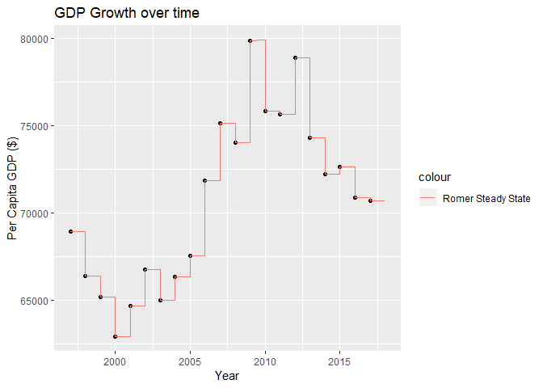
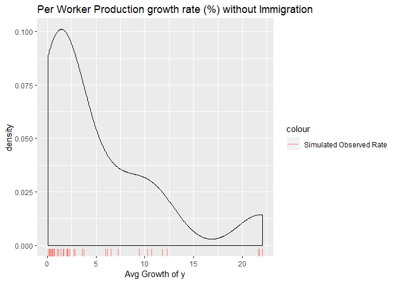
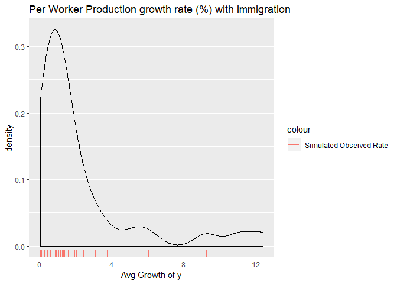
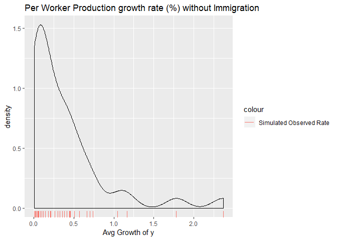
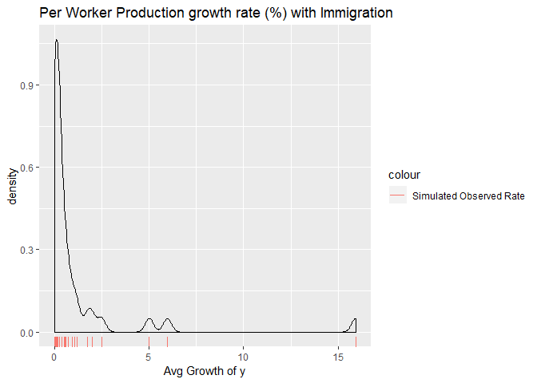

# Front matter


```r
# always clean up R environment
rm(list = ls())

# load all packages here
library(mdsr) # book package of utilities
library(stringr) # utility package for strings
library(tidyr) # tidyverse utilities
library(lubridate) # date utility package
library(data.table) # using fread function
library(rvest) # web scraping package
library(readxl) # read execel files
library(readr) # utilities
library(usmap) # plot usmap
library(tidyverse) # utitlity package

# user defined functions

# chooseCols - select columns of data according to regex
# createPopulationTable - create population table based off immigration or not
# random_sim - run run_sim with random parameters for beta, alpha, and chi
# readTable - read immigration table from yearbook webpage
# run_sim - run romer growth model simulation

# data
data(compiledData) # our data of GDP and immigration by GeoName and Industry
```
# Obtaining the data

Links to download data from BEA:

GDP by area:  https://apps.bea.gov/regional/downloadzip.cfm
GDP: https://www.bea.gov/data/gdp/gross-domestic-product
Homeland Security: https://www.dhs.gov/immigration-statistics/yearbook/2017


Codes to know:

* GDP in current dollars SAGDP2
* Compensation of Employees SAGDP4
* Real GDP in chained SAGDP9
* Per capita real GDP SAGDP10

## Compile GDP data into tables based on code


```r
# First read in all csv files into single data table
dataPath <- read_file('dataPath.txt')
```

```r
files <- list.files(path = dataPath,
                    pattern = "^SAGDP2N__ALL_AREAS_[0-9]*_[0-9]*.csv$")
# SAGDP2
nominalGDP <- fread(file = paste0(dataPath, files[1]), fill = TRUE)
head(nominalGDP)
```

```
##    GeoFIPS        GeoName Region TableName
## 1:   00000 United States*     NA   SAGDP2N
## 2:   00000 United States*     NA   SAGDP2N
## 3:   00000 United States*     NA   SAGDP2N
## 4:   00000 United States*     NA   SAGDP2N
## 5:   00000 United States*     NA   SAGDP2N
## 6:   00000 United States*     NA   SAGDP2N
##                            ComponentName                        Unit
## 1: Gross domestic product (GDP) by state Millions of current dollars
## 2: Gross domestic product (GDP) by state Millions of current dollars
## 3: Gross domestic product (GDP) by state Millions of current dollars
## 4: Gross domestic product (GDP) by state Millions of current dollars
## 5: Gross domestic product (GDP) by state Millions of current dollars
## 6: Gross domestic product (GDP) by state Millions of current dollars
##    IndustryId IndustryClassification
## 1:          1                    ...
## 2:          2                    ...
## 3:          3                     11
## 4:          4                111-112
## 5:          5                113-115
## 6:          6                     21
##                                        Description      1997      1998
## 1:                              All industry total 8577552.0 9062817.0
## 2:                              Private industries 7431991.6 7871499.7
## 3:     Agriculture, forestry, fishing, and hunting  108636.5   99756.5
## 4:                                           Farms   88136.0   79030.0
## 5:       Forestry, fishing, and related activities   20500.5   20726.5
## 6:   Mining, quarrying, and oil and gas extraction   95061.5   81691.6
##         1999       2000       2001       2002       2003       2004
## 1: 9630663.0 10252347.0 10581822.0 10936418.0 11458246.0 12213730.0
## 2: 8378315.3  8929320.4  9188887.4  9462019.7  9905898.8 10582458.5
## 3:   92590.4    98311.7    99835.6    95629.0   113953.5   142945.2
## 4:   70934.0    76043.0    78093.0    74033.0    91105.0   119356.0
## 5:   21656.4    22268.7    21742.6    21596.0    22848.5    23589.2
## 6:   84543.2   110581.3   123924.3   112417.0   138999.8   166517.5
##          2005       2006       2007       2008       2009       2010
## 1: 13036637.0 13814609.0 14451860.0 14712845.0 14448932.0 14992052.0
## 2: 11326368.9 12022614.1 12564794.5 12731236.5 12403879.9 12884088.6
## 3:   128346.7   125130.4   144062.3   147244.0   129967.8   146299.0
## 4:   104459.0    96264.0   115665.0   119476.0   103102.0   117629.0
## 5:    23887.7    28866.4    28397.3    27768.0    26865.8    28670.0
## 6:   225677.5   273321.6   313962.9   392174.6   275840.9   305838.1
##          2011       2012       2013       2014       2015       2016
## 1: 15542582.0 16197007.0 16784851.0 17521747.0 18219297.0 18707189.0
## 2: 13405520.0 14037518.8 14572341.0 15250030.3 15878808.0 16319357.2
## 3:   180944.9   179572.7   215600.6   200841.6   181220.2   164913.2
## 4:   152249.0   148939.0   184621.0   167940.0   146376.0   129458.0
## 5:    28695.8    30633.7    30979.6    32901.6    34844.2    35455.2
## 6:   356315.5   358797.6   386518.6   413005.2   257852.4   216218.4
##          2017
## 1: 19485394.0
## 2: 17031689.7
## 3:   169225.2
## 4:       (NA)
## 5:       (NA)
## 6:   268619.0
```

```r
write.csv(nominalGDP, file = paste0(dataPath, "SAGDP2.csv"))
```


```r
files <- list.files(path = dataPath,
                    pattern = "^SAGDP4N__ALL_AREAS_[0-9]*_[0-9]*.csv$")
# SAGDP4
compensationGDP <- fread(file = paste0(dataPath, files[1]), fill = TRUE)
head(compensationGDP)
```

```
##    GeoFIPS        GeoName Region TableName             ComponentName
## 1:   00000 United States*     NA   SAGDP4N Compensation of employees
## 2:   00000 United States*     NA   SAGDP4N Compensation of employees
## 3:   00000 United States*     NA   SAGDP4N Compensation of employees
## 4:   00000 United States*     NA   SAGDP4N Compensation of employees
## 5:   00000 United States*     NA   SAGDP4N Compensation of employees
## 6:   00000 United States*     NA   SAGDP4N Compensation of employees
##                    Unit IndustryId IndustryClassification
## 1: Thousands of dollars          1                    ...
## 2: Thousands of dollars          2                    ...
## 3: Thousands of dollars          3                     11
## 4: Thousands of dollars          4                111-112
## 5: Thousands of dollars          5                113-115
## 6: Thousands of dollars          6                     21
##                                        Description       1997       1998
## 1:                              All industry total 4713220000 5075701000
## 2:                              Private industries 3823490815 4146920542
## 3:     Agriculture, forestry, fishing, and hunting   26612033   27847300
## 4:                                           Farms   17142000   18139000
## 5:       Forestry, fishing, and related activities    9470033    9708300
## 6:   Mining, quarrying, and oil and gas extraction   35121127   35866000
##          1999       2000       2001       2002       2003       2004
## 1: 5409932000 5854629000 6046343000 6143368000 6362296000 6729301000
## 2: 4429108376 4811254215 4934296076 4957993662 5106612972 5406295095
## 3:   29474202   30200801   31308599   31636101   31645400   34942900
## 4:   18808000   19645000   20831000   20789000   20488000   22179000
## 5:   10666202   10555801   10477599   10847101   11157400   12763900
## 6:   34789205   35991903   38614296   35761001   37119202   41511700
##          2005       2006       2007       2008       2009       2010
## 1: 7077721000 7491255000 7889369000 8068679000 7767191000 7932969000
## 2: 5694360020 6047084126 6369771666 6475495372 6126325687 6241287161
## 3:   34645798   37995900   41802399   42137898   42318398   41360200
## 4:   22033000   21886000   25338000   25680000   25747000   24281000
## 5:   12612798   16109900   16464399   16457898   16571398   17079200
## 6:   47194697   56997603   62708594   72819895   64695692   69168097
##          2011       2012       2013       2014       2015       2016 2017
## 1: 8234013000 8575371000 8843638000 9258633000 9707911000 9968922000 (NA)
## 2: 6531992394 6871567316 7095280526 7467049747 7859364840 8079912142 (NA)
## 3:   41181100   48064000   48867098   50961701   50899700   53754996 (NA)
## 4:   23097000   28304000   28556000   29097000   27488000   29123000 (NA)
## 5:   18084100   19760000   20311098   21864701   23411700   24631996 (NA)
## 6:   80269298   90527000   93523492  101139700   91889800   75440090 (NA)
```

```r
write.csv(compensationGDP, file = paste0(dataPath, "SAGDP4.csv"))
```


```r
files <- list.files(path = dataPath,
                    pattern = "^SAGDP9N__ALL_AREAS_[0-9]*_[0-9]*.csv$")
# SAGDP9
realGDP <- fread(file = paste0(dataPath, files[1]), fill = TRUE)
head(realGDP)
```

```
##    GeoFIPS       GeoName Region TableName     ComponentName
## 1:   00000 United States     NA   SAGDP9N Real GDP by state
## 2:   00000 United States     NA   SAGDP9N Real GDP by state
## 3:   00000 United States     NA   SAGDP9N Real GDP by state
## 4:   00000 United States     NA   SAGDP9N Real GDP by state
## 5:   00000 United States     NA   SAGDP9N Real GDP by state
## 6:   00000 United States     NA   SAGDP9N Real GDP by state
##                                Unit IndustryId IndustryClassification
## 1: Millions of chained 2012 dollars          1                    ...
## 2: Millions of chained 2012 dollars          2                    ...
## 3: Millions of chained 2012 dollars          3                     11
## 4: Millions of chained 2012 dollars          4                111-112
## 5: Millions of chained 2012 dollars          5                113-115
## 6: Millions of chained 2012 dollars          6                     21
##                                        Description       1997       1998
## 1:                              All industry total 11521938.0 12038283.0
## 2:                              Private industries  9884799.8 10358425.6
## 3:     Agriculture, forestry, fishing, and hunting   140286.0   136879.5
## 4:                                           Farms   118101.2   113962.2
## 5:       Forestry, fishing, and related activities    22608.5    23072.6
## 6:   Mining, quarrying, and oil and gas extraction   263964.1   274624.0
##          1999       2000       2001       2002       2003       2004
## 1: 12610491.0 13130987.0 13262079.0 13493064.0 13879129.0 14406382.0
## 2: 10895080.0 11384006.8 11465143.6 11669108.8 12005868.9 12499287.7
## 3:   141020.5   161798.9   156154.9   161617.5   174162.5   188091.9
## 4:   116824.8   138243.7   128096.5   133545.0   145088.0   159782.0
## 5:    24197.8    25057.1    27868.7    28111.6    29401.0    29091.6
## 6:   266346.5   236200.3   273325.1   280554.9   248435.3   249877.7
##          2005       2006       2007       2008       2009       2010
## 1: 14912509.0 15338257.0 15626029.0 15604687.0 15208834.0 15598753.0
## 2: 12980914.9 13402321.3 13625237.1 13540590.8 13128308.9 13467315.0
## 3:   196126.0   199349.4   176568.7   180294.9   199976.1   193856.2
## 4:   168782.0   165516.0   144582.0   148473.0   170705.0   165055.0
## 5:    28570.5    33296.1    30952.0    30863.4    29688.9    29068.0
## 6:   254061.3   293062.6   315652.5   305545.2   350402.1   309258.8
##          2011       2012       2013       2014       2015       2016
## 1: 15840664.0 16197007.0 16495369.0 16899831.0 17386700.0 17659187.0
## 2: 13697389.9 14037519.0 14302266.6 14681841.1 15140166.1 15387507.2
## 3:   186395.0   179573.0   209387.5   210511.6   224592.0   234231.4
## 4:   157496.0   148939.0   179819.0   180346.0   193083.0   203271.0
## 5:    28936.3    30634.0    29604.1    30145.4    31675.3    31856.6
## 6:   320758.2   358798.0   372927.5   409998.5   444328.3   423112.5
##          2017
## 1: 18050693.0
## 2: 15718231.2
## 3:   222984.8
## 4:       (NA)
## 5:       (NA)
## 6:   429312.6
```

```r
write.csv(realGDP, file = paste0(dataPath, "SAGDP9.csv"))
```


```r
files <- list.files(path = dataPath,
                    pattern = "^SAGDP10N__ALL_AREAS_[0-9]*_[0-9]*.csv$")
# SAGDP10
perCapitaGDP <- fread(file = paste0(dataPath, files[1]), fill = TRUE)
head(perCapitaGDP)
```

```
##    GeoFIPS       GeoName Region TableName                ComponentName
## 1:   00000 United States     NA  SAGDP10N Per capita real GDP by state
## 2:   01000       Alabama      5  SAGDP10N Per capita real GDP by state
## 3:   02000        Alaska      8  SAGDP10N Per capita real GDP by state
## 4:   04000       Arizona      6  SAGDP10N Per capita real GDP by state
## 5:   05000      Arkansas      5  SAGDP10N Per capita real GDP by state
## 6:   06000    California      8  SAGDP10N Per capita real GDP by state
##                    Unit IndustryId IndustryClassification
## 1: Chained 2012 dollars          1                    ...
## 2: Chained 2012 dollars          1                    ...
## 3: Chained 2012 dollars          1                    ...
## 4: Chained 2012 dollars          1                    ...
## 5: Chained 2012 dollars          1                    ...
## 6: Chained 2012 dollars          1                    ...
##                                                     Description  1997
## 1:                Per capita real GDP (chained 2012 dollars) 1/ 42260
## 2:                Per capita real GDP (chained 2012 dollars) 1/ 32887
## 3:                Per capita real GDP (chained 2012 dollars) 1/ 68947
## 4:                Per capita real GDP (chained 2012 dollars) 1/ 35582
## 5:                Per capita real GDP (chained 2012 dollars) 1/ 31816
## 6:                Per capita real GDP (chained 2012 dollars) 1/ 42438
##     1998  1999  2000  2001  2002  2003  2004  2005  2006  2007  2008  2009
## 1: 43640 45192 46537 46539 46912 47841 49201 50463 51405 51874 51315 49577
## 2: 33736 34783 35165 35008 35908 36636 38737 39692 39922 39776 39273 37416
## 3: 66390 65178 62929 64657 66758 65006 66337 67549 71845 75135 74018 79894
## 4: 37503 39431 40265 40326 40641 42346 43034 45052 45991 46194 44182 40214
## 5: 32287 33681 33677 33409 34326 35432 36808 37630 37898 37265 36803 35393
## 6: 44574 47236 50310 49385 50002 51780 53474 55547 57527 58030 57675 54827
##     2010  2011  2012  2013  2014  2015  2016  2017
## 1: 50426 50829 51584 52162 53040 54157 54604 55418
## 2: 38086 38564 38700 38976 38499 38876 39007 39523
## 3: 75841 75659 78911 74312 72220 72635 70876 70683
## 4: 40188 40710 40996 40832 40768 41083 41726 42353
## 5: 36253 36852 36873 37804 38015 38007 38037 37930
## 6: 55137 55520 56406 57914 59686 62132 63635 65160
```

```r
write.csv(perCapitaGDP, file = paste0(dataPath, "SAGDP10.csv"))
```
 
## Scraping Immigration statistics 
 

```r
# returns immigration table found on the page of a specific url
readTable <- function(url) {
  table <- url %>%
            read_html() %>%
            html_nodes(xpath = paste0('/html/body/div[2]/section/div/div/div[2]/',
                                    'div/section/div/div/div/article/div[1]/',
                                    'div[2]/div/div/table')) %>%
            html_table()
  table <- table[[1]]
}
```


```r
# Started putting tables online in 2014, prior they are in csv for download.
# Use 2013, 2004 and scrape 2014-2017
dataPath <- paste0(substr(dataPath, 1, nchar(dataPath) - 4), "Immigration/")
```

```r
# Scrape data from 2014-2017
immigrants <- NA
immigrants <- data.frame(stringsAsFactors = FALSE)
year <- 2014
while (year <= 2017) {
  url <- paste0("https://www.dhs.gov/immigration-statistics/yearbook/", year,
                "/table22")
  if (year == 2014) {
    immigrants <- readTable(url)
  } else {
    immigrants[, as.character(year)] <- readTable(url)[, as.character(year)]
  }
  year <- year + 1
}
# Read in and add data from 8_ - 2013
# Table33
# 2103 table 22
files <- list.files(path = dataPath, pattern = ".(xls|xlsx)$")
data1 <- read_excel(paste0(dataPath, files[1]))
data2 <- read_excel(paste0(dataPath, files[2]))

data1 <- data1[1:(length(data1$`Table 22.`) - 3), ]
data1 <- data1[3:length(data1$`Table 22.`), ]
data1[1, 1] <- "State or Territory of Residence"

data2 <- data2 %>%
  filter(!is.na(`TABLE 33.`))
data2 <- data2[1:(length(data2$`TABLE 33.`) - 2), ]
data2 <- data2[2:length(data2$`TABLE 33.`), ]
data2[1, 1] <- data1[1, 1]

colnames(data1) <- as.character(unlist(data1[1, ]))
data1 <- data1[-1, ]
data1 <- data1 %>%
  select(-c("2012", "2013"))

colnames(data2) <- as.character(unlist(data2[1, ]))
data2 <- data2[-1, ]
data2 <- data2 %>%
  select(-c("2004"))

# Convert data types to numeric to match with data1
colsNum <- colnames(data2)
colsNum <- colsNum[2:length(colsNum)]
data2[colsNum] <- sapply(data2[colsNum], as.numeric)
colsNum <- colnames(immigrants)
colsNum <- colsNum[2:length(colsNum)]
immigrants[colsNum] <- sapply(immigrants[colsNum], function(x) gsub(",", "", x))
immigrants[colsNum] <- sapply(immigrants[colsNum], as.numeric)

immigrants <- immigrants %>%
      left_join(data1, by = c("State or Territory of Residence"))
immigrants <- immigrants %>%
      left_join(data2, by = c("State or Territory of Residence"))
write.csv(immigrants, file = paste0(dataPath, "immigration.csv"))
```
 
## Read in tables

```r
immigrants <- fread(file = paste0(dataPath, "immigration.csv"))
dataPath <- paste0(substr(dataPath, 1, nchar(dataPath) - 12), "GDP/")
nominalGDP <- fread(file = paste0(dataPath, "SAGDP2.csv"))
compensationGDP <- fread(file = paste0(dataPath, "SAGDP4.csv"))
realGDP <- fread(file = paste0(dataPath, "SAGDP9.csv"))
perCapitaGDP <- fread(file = paste0(dataPath, "SAGDP10.csv"))
```

## Join two data sets

Now let us join the GDP data and imigration data into a single table.


```r
econData <- nominalGDP %>%
  rbind(compensationGDP) %>%
  rbind(realGDP) %>%
  rbind(perCapitaGDP) %>%
  filter(nchar(TableName) != 0)
# Name GDP years
names <- colnames(econData)
for (i in 1:length(names)) {
  if (!is.na(as.numeric(names[i]))) {
    econData[, paste0(names[i])] <- as.numeric(econData[, paste0(names[i])])
    names[i] <- paste0("GDP: ", names[i])
  }
}
colnames(econData) <- names
# Name immigation years
names <- colnames(immigrants)
for (i in 1:length(names)) {
  if (!is.na(as.numeric(names[i]))) {
    names[i] <- paste0("Immigrants: ", names[i])
  }
}
colnames(immigrants) <- names
# Change total name
immigrants[1, 1] <- "United States"
compiledData <- econData %>%
  left_join(immigrants, by = c("GeoName" = "State or Territory of Residence"))
```

# Unsupervised Learning

Wanted to see how Real GDP, Compensation GDP, and Immigration was state by state.


```r
# creating a table of just states and their totals over 20 years of GDP
RealClean <-
  compiledData %>%
  filter(TableName == "SAGDP9N") %>%
  filter(GeoName != "United States*") %>%
  filter(GeoName != "United States") %>%
  filter(IndustryId == "1")
```


```r
# Created a table with the state and its total GDP from 1997 to 2016
GDPRealTotal <-
  RealClean %>%
  transmute(GDPRealTotal = `GDP: 1997` + `GDP: 1998` + `GDP: 1999` +
              `GDP: 2000` + `GDP: 2001` + `GDP: 2002` + `GDP: 2003` +
              `GDP: 2004` + `GDP: 2005` + `GDP: 2006` + `GDP: 2007` +
              `GDP: 2008` + `GDP: 2009` + `GDP: 2010` + `GDP: 2011` +
              `GDP: 2012` + `GDP: 2013` + `GDP: 2014` + `GDP: 2015` +
              `GDP: 2016`,
           Territory = GeoName)
```


```r
# creating a table of just states and their totals over 20 years of Real GDP
CompensationClean <-
  compiledData %>%
  filter(TableName == "SAGDP4N") %>%
  filter(GeoName != "United States*") %>%
  filter(GeoName != "United States") %>%
  filter(IndustryId == "1")
```


```r
# Created a table with the state and its compensational GDP from 1997 to 2016
GDPCompensationTotal <-
  CompensationClean %>%
  transmute(GDPCompensationTotal = `GDP: 1997` + `GDP: 1998` + `GDP: 1999` +
              `GDP: 2000` + `GDP: 2001` + `GDP: 2002` + `GDP: 2003` +
              `GDP: 2004` + `GDP: 2005` + `GDP: 2006` + `GDP: 2007` +
              `GDP: 2008` + `GDP: 2009` + `GDP: 2010` + `GDP: 2011` +
              `GDP: 2012` + `GDP: 2013` + `GDP: 2014` + `GDP: 2015` +
              `GDP: 2016`,
           Territory = GeoName)
```


```r
# Created a table of number of immigrants year by year per state
immigrantsNoUS <-
  immigrants %>%
  filter(`State or Territory of Residence` != "United States" |
           `State or Territory of Residence` != "United States")
```


```r
# Created a table with the total number of immigrants per state from 1997 to 2016
immigrantsTotal <-
  immigrantsNoUS %>%
  transmute(immigrantsTotal = `Immigrants: 1997` + `Immigrants: 1998` +
              `Immigrants: 1999` + `Immigrants: 2000` + `Immigrants: 2001` +
              `Immigrants: 2002` + `Immigrants: 2003` + `Immigrants: 2004` +
              `Immigrants: 2005` + `Immigrants: 2006` + `Immigrants: 2007` +
              `Immigrants: 2008` + `Immigrants: 2009` + `Immigrants: 2010` +
              `Immigrants: 2011` + `Immigrants: 2012` + `Immigrants: 2013` +
              `Immigrants: 2014` + `Immigrants: 2015` + `Immigrants: 2016`,
            Territory = `State or Territory of Residence`)
```

I am joining the Total number of immigrants, total GDP, and Compensational GDP per state into one table


```r
immigrantGDP <-
  left_join(immigrantsTotal, GDPRealTotal, key = "Territory")
```

```
## Joining, by = "Territory"
```


```r
immigrantGDP <-
  left_join(immigrantGDP, GDPCompensationTotal)
```

```
## Joining, by = "Territory"
```

I am removing values and making the second column the row name


```r
immigrantGDP <- immigrantGDP[-c(12, 41, 54, 55), ]
```


```r
immigrantGDPClean <- immigrantGDP[, -2]
rownames(immigrantGDPClean) <- immigrantGDP[, 2]
```


```r
immigrantGDPClean <- immigrantGDPClean[-c(27), ]
```

Wanted to see how those three variabels affected the data overall


```r
GDPimmigrant_pca <-
  prcomp(immigrantGDPClean, scale = TRUE)  # standardize the variables
# the result is a list object
str(GDPimmigrant_pca)
```

```
## List of 5
##  $ sdev    : num [1:3] 1.7049 0.3033 0.0377
##  $ rotation: num [1:3, 1:3] 0.568 0.582 0.582 0.823 -0.406 ...
##   ..- attr(*, "dimnames")=List of 2
##   .. ..$ : chr [1:3] "immigrantsTotal" "GDPRealTotal" "GDPCompensationTotal"
##   .. ..$ : chr [1:3] "PC1" "PC2" "PC3"
##  $ center  : Named num [1:3] 2.66e+05 5.93e+06 2.93e+09
##   ..- attr(*, "names")= chr [1:3] "immigrantsTotal" "GDPRealTotal" "GDPCompensationTotal"
##  $ scale   : Named num [1:3] 5.90e+05 7.12e+06 3.46e+09
##   ..- attr(*, "names")= chr [1:3] "immigrantsTotal" "GDPRealTotal" "GDPCompensationTotal"
##  $ x       : num [1:50, 1:3] -0.623 -1.068 -0.217 -0.877 8.67 ...
##   ..- attr(*, "dimnames")=List of 2
##   .. ..$ : chr [1:50] "Alabama" "Alaska" "Arizona" "Arkansas" ...
##   .. ..$ : chr [1:3] "PC1" "PC2" "PC3"
##  - attr(*, "class")= chr "prcomp"
```


```r
(-1) * GDPimmigrant_pca$rotation[, 1:2] %>% round(2)
```

```
##                        PC1   PC2
## immigrantsTotal      -0.57 -0.82
## GDPRealTotal         -0.58  0.41
## GDPCompensationTotal -0.58  0.40
```


```r
GDPimmigrant_pca$x %>%
  as.data.frame() %>%  # `ggplot2` expects a data frame object
  rownames_to_column() %>%
  ggplot(aes(x = -PC1, y = -PC2)) +
  geom_text(aes(label = rowname), size = 3) +
  xlab("Best Vector from PCA (approx. GDP Data)") +
  ylab("2nd Best Vector from PCA (approx. Immigration)") +
  ggtitle("Two-dimensional representation of GDP change based on immigration")
```

<!-- -->

I am making a k means clustering of total GDP, compensational GDP, and immigration to see which states are most alike.


```r
immigrantGDP_std <-
  scale(immigrantGDPClean) %>%
  as.data.frame()
```


```r
set.seed(2)
immigrantGDP_kmean <-
  immigrantGDP_std %>%
  kmeans(centers = 4, nstart = 10)
```


```r
k_meansGroups <-
  data.frame(immigrantGDP_kmean[1]) %>%
  rownames_to_column()
```


```r
names(k_meansGroups) <- c("State", "cluster")
```


```r
StateCodes <-
  k_meansGroups %>%
  mutate(fips = fips(k_meansGroups$State))
```


```r
plot_usmap(data = StateCodes, values = "cluster")
```

<!-- -->

Looking at the map we see that California is not like any other states, and then the next group only has Florida, New York, and Texas. This would make sense because the largest states would have the highest immigration counts and the largest GDP values.

# Creating visualization

I wanted to create a visualization using 3 variables.


```r
GraphingData <- immigrantGDP[-c(27), ]
```


```r
colnames(GraphingData)[colnames(GraphingData) == "Territory"] <- "GeoName"
```


```r
# creating a table with the states and what region they are apart of
StateAndRegion <-
  RealClean %>%
  select(GeoName, Region)
```


```r
#joined the tables so now each state has the total GDP and total immigration count from 1997 to 2016
GraphingData <-
  left_join(GraphingData, StateAndRegion)
```

```
## Joining, by = "GeoName"
```

```r
GraphingData <-
  GraphingData %>%
  mutate(immigrantsTotal = immigrantsTotal / 1000,
         GDPCompensationTotal = GDPCompensationTotal / 1000000)
```


```r
GraphingData %>%
  ggplot() +
  geom_point(aes(x = GDPCompensationTotal, y = immigrantsTotal,
                 colour = Region)) +
  xlab("GDP (millions)") +
  ylab("Number of Immigrants (Thousands)") +
  ggtitle("GDP and Immigration Totals from 1997 to 2016")
```

<!-- -->

This graph shows us that there is one point that is an outlier and it is California. Also, this shows that there is no distinct grouping based on region over the past 20 years.

# Simulating the Romer Growth Model

The Romer Growth model is a growth model in economics thats endogenizes the TFP
(Total Factor Productivity) variable. It basically is a production model that
divides labor between production of goods and services and the produciton of
ideas. Below we use the idea that the growth rate of per worker production (per
capita GDP) is based off of beta, exponent of capital in production function, alpha,
percentage of population devoted to production of ideas, and chi, the productivity of
the workers producing ideas. It is also based on the total population.

As an equation we can then state if in steady state:
\[g_{y^*} = \frac{1}{1-\beta}g_A = \frac{1}{1-\beta}\chi\alpha\overline{N}\]

The steady state is the point at which investment in the economy merely replaces
depreciating capital and buying capital for new workers.

## User Functions

Let's create a function to choose columns we want: (like select clause of SQL)

```r
chooseCols <- function(x, regex) {
  cols <- grep(regex, names(x), value = TRUE)
  return(x[, cols])
}
```

Next let us calculate the population of the regions based off real GDP and per capita
GDP.


```r
# Returns table of population in millions
createPopulationTable <- function(immigrants = TRUE) {
  # Divide real GDP by percapita
  real <- compiledData %>%
    filter(TableName == "SAGDP9N" & IndustryId == 1)
  per <- compiledData %>%
    filter(TableName == "SAGDP10N")
  real <- chooseCols(real, "^(GDP:|GeoName)")
  per <- chooseCols(per, "^(GDP:|GeoName)")
  pop <- real
  cols <- names(per)
  for (i in 2:length(cols)) {
    if (immigrants == TRUE) {
      pop[, paste0(cols[i])] <- real[, paste0(cols[i])] / per[, paste0(cols[i])]
    } else {
      year <- 1995 + i
      immigrants <- compiledData %>%
          filter(TableName == "SAGDP10N") %>%
          chooseCols(paste0("^(Immigrants: ", as.character(year), "|GeoName)"))
      pop[, paste0(cols[i])] <- (real[, paste0(cols[i])] /
                                   per[, paste0(cols[i])]) - (immigrants[, 2] /
                                                                1000000)
    }
  }
  return(pop)
}
```

```r
bop <- createPopulationTable(FALSE)
head(bop)
```

```
##         GeoName   GDP: 1997   GDP: 1998   GDP: 1999   GDP: 2000
## 1 United States 272.0458356 275.3912709 278.2026078 281.2735130
## 2       Alabama   4.3672248   4.4040254   4.4290092   4.4505983
## 3        Alaska   0.6122109   0.6189372   0.6241438   0.6272921
## 4       Arizona   4.7331927   4.8791950   5.0151249   5.1498882
## 5      Arkansas   2.6002565   2.6260297   2.6514122   2.6783319
## 6    California  32.2988704  32.8328904  33.2153235  33.6873861
##     GDP: 2001  GDP: 2002   GDP: 2003   GDP: 2004  GDP: 2005   GDP: 2006
## 1 284.3587904 287.051292 289.6463046 292.2695399 294.909443 297.6780549
## 2   4.4672527   4.478787   4.5023637   4.5300350   4.569040   4.6269904
## 3   0.6330002   0.641406   0.6476644   0.6585127   0.665996   0.6744714
## 4   5.2651816   5.390240   5.5031420   5.6459144   5.832268   6.0194791
## 5   2.6914391   2.705380   2.7240741   2.7488564   2.780123   2.8206518
## 6  34.2761982  34.722063  35.1176419  35.4290564  35.657563  35.8681107
##     GDP: 2007   GDP: 2008  GDP: 2009   GDP: 2010  GDP: 2011   GDP: 2012
## 1 300.5699853 303.0494758 306.028256 308.7195746 310.951993 313.2354126
## 2   4.6715452   4.7162188   4.756120   4.7835294   4.796202   4.8118436
## 3   0.6794465   0.6863094   0.697796   0.7131812   0.721148   0.7296386
## 4   6.1555282   6.2562650   6.330705   6.3966646   6.452731   6.5311777
## 5   2.8474456   2.8721911   2.895199   2.9204832   2.937098   2.9475773
## 6  36.0688450  36.3061309  36.781723  37.1983552  37.521476  37.8601072
##     GDP: 2013   GDP: 2014   GDP: 2015   GDP: 2016   GDP: 2017
## 1 315.4535168 317.9708487 320.3122655 322.6515807 325.0116891
## 2   4.8259061   4.8387298   4.8480637   4.8581530   4.8736659
## 3   0.7356755   0.7356867   0.7370108   0.7405498   0.7387878
## 4   6.6029425   6.6951414   6.7884597   6.8971866   7.0038509
## 5   2.9552339   2.9631113   2.9740206   2.9863972   3.0029325
## 6  38.1828890  38.5610946  38.8764053  39.1448652  39.3795083
```

```r
bop <- createPopulationTable(TRUE)
head(bop)
```

```
##         GeoName   GDP: 1997   GDP: 1998   GDP: 1999   GDP: 2000
## 1 United States 272.6440606 275.8543309 279.0425518 282.1623010
## 2       Alabama   4.3678688   4.4046834   4.4301412   4.4521513
## 3        Alaska   0.6129679   0.6199322   0.6247768   0.6279601
## 4       Arizona   4.7369597   4.8833000   5.0238619   5.1606432
## 5      Arkansas   2.6010655   2.6262737   2.6518542   2.6785729
## 6    California  32.4863024  32.9876834  33.4993945  33.9880481
##     GDP: 2001  GDP: 2002   GDP: 2003   GDP: 2004  GDP: 2005   GDP: 2006
## 1 284.9669954 287.625000 290.1095086 292.8066909 295.513723 298.3806439
## 2   4.4676617   4.480063   4.5035457   4.5307690   4.569835   4.6289364
## 3   0.6337102   0.642335   0.6484094   0.6592897   0.666947   0.6753024
## 4   5.2734266   5.396307   5.5103670   5.6524144   5.839053   6.0291861
## 5   2.6915711   2.705963   2.7247911   2.7496794   2.781113   2.8217848
## 6  34.4796132  34.871617  35.2534569  35.5746494  35.828052  36.0209467
##     GDP: 2007   GDP: 2008  GDP: 2009   GDP: 2010  GDP: 2011   GDP: 2012
## 1 301.2304623 304.0960148 306.771971 309.3394876 311.646186 313.9928466
## 2   4.6728882   4.7182008   4.757895   4.7855564   4.798641   4.8139276
## 3   0.6802955   0.6874544   0.698896   0.7140122   0.722263   0.7308246
## 4   6.1676192   6.2803200   6.343082   6.4070046   6.465515   6.5442677
## 5   2.8486596   2.8745211   2.896847   2.9217582   2.938657   2.9491823
## 6  36.2505290  36.6040399  36.961477  37.3277092  37.672659  38.0189572
##     GDP: 2013   GDP: 2014   GDP: 2015   GDP: 2016   GDP: 2017
## 1 316.2334458 318.6242647 321.0425245 323.4046407 325.7189541
## 2   4.8277171   4.8399958   4.8508977   4.8604840   4.8747109
## 3   0.7367585   0.7367627   0.7379748   0.7415218   0.7397988
## 4   6.6161075   6.7064094   6.8022077   6.9085606   7.0163129
## 5   2.9568009   2.9647823   2.9755966   2.9882062   3.0042605
## 6  38.3476810  38.7013286  39.0323843  39.2966952  39.5368723
```

## Getting the data


```r
# per capita GDP is tableName SAGDP10N
perCapitaGDP <- compiledData %>%
  filter(TableName == "SAGDP10N")
outputPerWorker <- chooseCols(perCapitaGDP, "^(GDP:|GeoName)")
head(outputPerWorker)
```

```
##         GeoName GDP: 1997 GDP: 1998 GDP: 1999 GDP: 2000 GDP: 2001
## 1 United States     42260     43640     45192     46537     46539
## 2       Alabama     32887     33736     34783     35165     35008
## 3        Alaska     68947     66390     65178     62929     64657
## 4       Arizona     35582     37503     39431     40265     40326
## 5      Arkansas     31816     32287     33681     33677     33409
## 6    California     42438     44574     47236     50310     49385
##   GDP: 2002 GDP: 2003 GDP: 2004 GDP: 2005 GDP: 2006 GDP: 2007 GDP: 2008
## 1     46912     47841     49201     50463     51405     51874     51315
## 2     35908     36636     38737     39692     39922     39776     39273
## 3     66758     65006     66337     67549     71845     75135     74018
## 4     40641     42346     43034     45052     45991     46194     44182
## 5     34326     35432     36808     37630     37898     37265     36803
## 6     50002     51780     53474     55547     57527     58030     57675
##   GDP: 2009 GDP: 2010 GDP: 2011 GDP: 2012 GDP: 2013 GDP: 2014 GDP: 2015
## 1     49577     50426     50829     51584     52162     53040     54157
## 2     37416     38086     38564     38700     38976     38499     38876
## 3     79894     75841     75659     78911     74312     72220     72635
## 4     40214     40188     40710     40996     40832     40768     41083
## 5     35393     36253     36852     36873     37804     38015     38007
## 6     54827     55137     55520     56406     57914     59686     62132
##   GDP: 2016 GDP: 2017
## 1     54604     55418
## 2     39007     39523
## 3     70876     70683
## 4     41726     42353
## 5     38037     37930
## 6     63635     65160
```

## Creating a basic simulation

Now we can create a simulation to test what steady state growth would be with and
without immigrants.


```r
# Romer growth parameters
b <- 0.3
a <- 0.2
c <- 0.04
# Population in millions
run_sim <- function(beta, alpha, chi, area = "United States", immigrants = TRUE) {
  row <- grep(area, unique(perCapitaGDP$GeoName))
  population <- createPopulationTable(immigrants)
  growth <- population
  cols <- names(population)
  colsGrowth <- gsub("GDP:", "Growth:", cols)
  for (i in 2:length(cols)) {
    growth[, paste0(colsGrowth[i])] <- (1 / (1 - beta)) * alpha * chi *
      population[, paste0(cols[i])]
  }
  growth <- chooseCols(growth, "^(Growth:|GeoName)")
  # Show graph of PerCapita and growth
  years <- grep("[0-9]$", names(outputPerWorker), value = TRUE)
  years <- as.numeric(gsub("GDP: ", "", years))
  totalper <- as.numeric((as.vector(outputPerWorker[row, c(2:22)])))
  data <- data.frame(year = years, output = totalper)
  growthPaths <- data %>%
    ggplot(aes(x = year, y = output)) +
    geom_point()
  
  for (i in 1:length(years)) {
    currentYear <- years[i]
    if (i == 1) {
      yearVal <- seq(from = currentYear, to = (currentYear + 1), by = 0.01)
      delta <- outputPerWorker[row, (i + 1)] * (growth[row,( i + 1)] / 100)
      out <- (yearVal - currentYear) * delta  + outputPerWorker[row,(i + 1)]
    } else {
      currentYears <- seq(from = currentYear, to = (currentYear + 1), by = 0.01)
      yearVal <- c(yearVal, currentYears)
      delta <- outputPerWorker[row, (i + 1)] * (growth[row, (i + 1)] / 100)
      out <- c(out, (currentYears - currentYear) * delta +
                 outputPerWorker[row, (i + 1)])
    }
  }
  slope <- data.frame(yearVal = yearVal, out = out)
  growthPaths <- growthPaths +
    geom_line(data = slope, aes(x = yearVal, y = out,
                                color = "Romer Steady State"))
  growthPaths <- growthPaths +
    ggtitle("GDP Growth over time") +
    xlab("Year") +
    ylab("Per Capita GDP ($)")
  
  avgGrowth <- mean(as.numeric((as.vector(growth[row, c(2:22)]))))
  return(list(growthPaths, avgGrowth))
}
```


When we run the sim with preset values we can see the growth of the economy as
a whole versus the growth of Alaska's economy. When the line connects the dots
the economy is approximately at a steady state, but when the dot is more of a step
from the line, there must be some sort of shock to the economy. Knowing this you can
see that Alaska's economy only changes due to shock's in TFP. This follows assumptions
of the Solow growth model and implies that Alaska is not working to produce it's own
techonologies, which can be reflective of smaller nations around the world.


```r
run_sim(b, a, c, area = "United States", immigrants = TRUE)[[1]]
```

<!-- -->

```r
run_sim(b, a, c, area = "Alaska", immigrants = FALSE)[[1]]
```

<!-- -->

## Randomizing the simulation

Now let us randomize the parameters to our growth rate and see how immigrants can effect the
growth rate.


```r
random_sim <- function(area = "United States", immigrants = TRUE) {
  beta <- runif(1)
  alpha <- runif(1)
  chi <- 1 / rexp(1, rate = 0.005) # weight productivity low
  if (chi >= 1) {
    chi <- 1
  }
  run_sim(beta = beta, alpha = alpha, chi = chi, area = area,
          immigrants = immigrants)
}
simulations <- mosaic::do(40) * random_sim(area = "United States",
                                           immigrants = FALSE)
data <- data.frame(growths = unlist(simulations$V2))
data <- data %>%
  filter(growths <= 25)
data %>%
  ggplot(aes(x = growths)) +
  geom_density() +
  xlab("Avg Growth of y") +
  ggtitle("Per Worker Production growth rate (%) without Immigration") +
  geom_rug(aes(color = "Simulated Observed Rate"))
```

<!-- -->

```r
simulations <- mosaic::do(40) * random_sim(area = "United States",
                                           immigrants = TRUE)
data <- data.frame(growths = unlist(simulations$V2))
data <- data %>%
  filter(growths <= 25)
data %>%
  ggplot(aes(x = growths)) +
  geom_density() +
  xlab("Avg Growth of y") +
  ggtitle("Per Worker Production growth rate (%) with Immigration") +
  geom_rug(aes(color = "Simulated Observed Rate"))
```

<!-- -->

You can see that the growth rates with immigrants are slightly higher, but there
is not much of an impact on the economy as a whole. This would imply that our
current influx of immigrants also does not decrease per capita GDP or per worker
production, because the affect is has on per capita GDP would scale with its
effect on the growth rate. What about a smaller area of the economy with a proportionately
larger amount of immigrants? We can look at Texas.


```r
simulations <- mosaic::do(40, parallel = FALSE) * random_sim(area = "Texas",
                                                             immigrants = FALSE)
data <- data.frame(growths = unlist(simulations$V2))
data <- data %>%
  filter(growths <= 25)
data %>%
  ggplot(aes(x = growths)) +
  geom_density() +
  xlab("Avg Growth of y") +
  ggtitle("Per Worker Production growth rate (%) without Immigration") +
  geom_rug(aes(color = "Simulated Observed Rate"))
```

<!-- -->

```r
simulations <- mosaic::do(40, parallel = FALSE) * random_sim(area = "Texas",
                                                             immigrants = TRUE)
data <- data.frame(growths = unlist(simulations$V2))
data <- data %>%
  filter(growths <= 25)
data %>%
  ggplot(aes(x = growths)) +
  geom_density() +
  xlab("Avg Growth of y") +
  ggtitle("Per Worker Production growth rate (%) with Immigration") +
  geom_rug(aes(color = "Simulated Observed Rate"))
```

<!-- -->

In Texas you can definitely see that immigration would have a larger effect on the
growth rate of the economy, but this also means it would have a larger short term effect
of decreasing real per capita GDP. In layman's terms in the short run Texans are more
likely to earn less money on average, but in the long run the Texan economy is likely
to grow at a faster rate.

## Processing the simulation


```r
simsRun <- c(75,200,350,500)
withParallel <- c(0,0,0,0)
withoutParallel<- c(0,0,0,0)
timeData <- data.frame(simsRun, withoutParallel = withoutParallel,
                       withParallel = withParallel)
for (i in 1:4) {
  ptm <- Sys.time()
  mosaic::do(simsRun[i]) * random_sim(area = "United States",
                                      immigrants = FALSE)
  timeData[i,3] <- Sys.time() - ptm
}
for (i in 1:4) {
  ptm <- Sys.time()
  mosaic::do(simsRun[i], parallel = FALSE) * random_sim(area = "United States",
                                                        immigrants = FALSE)
  timeData[i,2] <- Sys.time() - ptm
}
head(timeData)
```

```
##   simsRun withoutParallel withParallel
## 1      75        3.576450     3.668226
## 2     200        9.459743     8.967005
## 3     350       16.741855    16.134303
## 4     500       24.072621    24.395423
```

Here I wanted to show my reasoning for running without being in parallel for the
earlier simulation. Due to some kind of processing overhead, at only 40 simulations,
it is actually faster to run without parallel processes and at some line between 200
and 500 it does actually become faster to run in parallel. To me this implies there
isn't code that does a redudant/similar thing a lot of the times to make the simulation slow.
